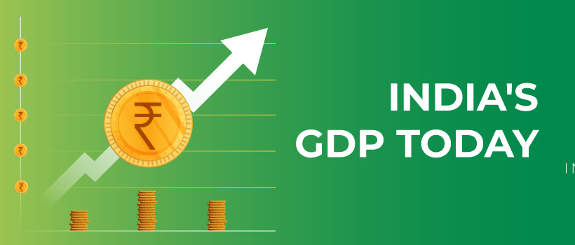

# India GDP Rate 1960 to 2021 - Data Analysis
This ipython notebook is the Exploratory data analysis (EDA) of the India GDP Rate 1960 to 2021. The dataset used has been compiled from various sources by web scrapping. You can follow the analysis on <a href="https://www.kaggle.com/code/shrikrishnaparab/india-gdp-rate-1960-to-2021-data-analysis">kaggle</a>

## Packeges Used:
 ![Python][python] ![NumPy][numpy-image] ![Pandas][Pandas-image] ![Matplotlib][Matplotlib-image]  ![Jupyter Notebook][ipython-image]
 
[python]: https://img.shields.io/badge/python-3670A0?style=for-the-badge&logo=python&logoColor=ffdd54
[numpy-image]: https://img.shields.io/badge/numpy-%23013243.svg?style=for-the-badge&logo=numpy&logoColor=white
[Pandas-image]: https://img.shields.io/badge/pandas-%23150458.svg?style=for-the-badge&logo=pandas&logoColor=white
[Matplotlib-image]: https://img.shields.io/badge/Matplotlib-%23ffffff.svg?style=for-the-badge&logo=Matplotlib&logoColor=black
[ipython-image]: https://img.shields.io/badge/jupyter-%23FA0F00.svg?style=for-the-badge&logo=jupyter&logoColor=white

